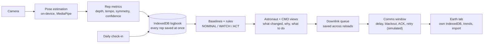

# OrbitFit

**Exercise-based astronaut health self-monitoring that works offline.**
Decision support, not a diagnosis. Built as a static web app: no backend, no accounts, no network calls at runtime.

- **Live demo:** `[PLACEHOLDER: https://your-orbitfit-url.example.com]`
- **30-second video:** `[PLACEHOLDER: https://your-video-link.example.com]`
- **Challenge:** NASA Space Apps Challenge 2026, *"Create Health Monitoring Software for Astronauts on Space Missions"*
- **Team:** Syed Hassaan Areeb Kazmi, Eman Fatima, Mohammad Bin Javed, Azam Tariq, Hudebia (Pakistan)

> Prototype decision-support tool. Not a medical device. Thresholds are demonstration values, not clinically validated.

## What it does

In microgravity, muscles and bones decline unless crews exercise hard and regularly. On long missions the crew is far from
flight surgeons, with delayed messages and blackouts. OrbitFit turns the exercise astronauts already do into the measurement:
a laptop or tablet **camera** is the only sensor, pose estimation runs **on the device**, and the app answers one question:
*is this person deconditioning, and what should they do?*

| Screen | What it is |
|---|---|
| `/crew` | Astronaut view: live workout feedback (depth, tempo, symmetry), simulated ARED target load for the local gravity, 30-second daily check-in, own status |
| `/cmo` | Crew Medical Officer view: status of all crew, trend charts, alert log, notes, CSV export / import |
| `/downlink` | Build a compact flight-surgeon packet and send it when a (simulated) comms window opens |
| `/downlink?role=earth` | The (simulated) Earth receiver, opened in a second tab |
| `/about`, `/sources` | Problem, hazards addressed, limitations, benchmark; NASA references and credits |

## Quick start (local)

**Requirements:** Chrome or Edge (current version). The camera and offline mode need `http://localhost` or `https://`; opening
`dist/index.html` straight from disk does **not** work.

**Fastest, nothing to install except Node.js** (Node 18 or newer; needs the internet once to fetch a small helper):

- Windows: double-click **`start.bat`** (or run `.\start.bat` in a terminal)
- Mac / Linux: run **`./start.sh`**

It serves the prebuilt `dist/` folder at <http://localhost:4173> and opens your browser.

**From source** (Node **22.12 or newer**: Vite 8 and Vitest 5 do not run on older versions):

```bash
npm install     # 1. install dependencies (also copies the MediaPipe WASM into public/)
npm start       # 2. serve the committed dist/ at http://localhost:4173
                # 3. open http://localhost:4173 in Chrome or Edge
```

| Command | What it does |
|---|---|
| `npm run dev` | Development server with hot reload |
| `npm run build` | Type-check, build to `dist/`, then verify the output (`scripts/verify-dist.mjs`) |
| `npm start` | Serve `dist/` on port 4173 (`vite preview`) |
| `npm test` | Unit and compliance tests (Vitest) |
| `npm run verify` | Check that `dist/` is complete (model, WASM, `.htaccess`, base path) |

### Try it in two minutes (for judges)

A **Judge Quick Start** panel appears on first load (reopen it from the header). In short:

1. **Demo Mode, no webcam needed:** open `/crew?demo=1`. A bundled squat video runs through the same on-device pipeline as the webcam.
2. **Change gravity** in the header (Earth, ISS, Moon, Mars, custom) and watch the target load, tempo and weekly volume change.
3. **Send a downlink:** open the Earth tab (`/downlink?role=earth`), then on `/downlink` queue a packet. In BLACKOUT it waits; open the comms window and it arrives after the simulated delay.
4. **Turn off the internet.** It keeps working.

The three demo crew members (30 days each) are generated: one deconditioning (WATCH, then ACT), one nominal, one with
left/right asymmetry and knee pain. *CMO page, Offline logbook, Reset demo data* restores them at any time.

### Test offline

1. Load the app once while online and wait for the header badge to say **OFFLINE READY** (about 40 MB is cached, mostly the pose model and WASM).
2. Open DevTools (F12), go to **Network**, set throttling to **Offline**, and reload. Everything, including Demo Mode, still works.
3. Open the Earth tab the same way: `/downlink?role=earth` (it is just a second tab on the same device; it also works offline).

## Deploy to your own hosting (Apache / cPanel)

The server only delivers files; all logic runs in the browser. There is no server-side code in this repository.

1. **Build:** `npm run build` (this produces `dist/` and checks it).
2. **Upload** the **contents** of `dist/` to the web root (or a subdomain root) with the cPanel File Manager or FTP. Make sure the hidden file **`.htaccess`** is included (turn on *Show hidden files*).
3. **Enable SSL** (cPanel: *SSL/TLS Status → Run AutoSSL*). The camera and the offline service worker only work on HTTPS. `.htaccess` redirects HTTP to HTTPS.

`.htaccess` sets the `.wasm` / `.task` MIME types, falls back to `index.html` so deep links (`/cmo`, `/downlink`, `/about`) load directly,
caches hashed assets for a year, and never caches `index.html`, `sw.js` or the manifest.

**Subfolder instead of a subdomain** (for example `https://example.com/orbitfit/`): set the base path when building.

```powershell
# Windows PowerShell
$env:VITE_BASE = "orbitfit"; npm run build
```
```bash
# Mac / Linux / Git Bash
VITE_BASE=orbitfit npm run build
```

`orbitfit`, `/orbitfit` and `/orbitfit/` all mean the same thing. (In Git Bash on Windows, do not write the leading slash: it rewrites
`/orbitfit/` into a Windows path.) Then upload `dist/` into the `orbitfit` folder.

## How it works



- **Measurement.** Joint angles come from MediaPipe's 3D world landmarks, so they do not depend on which way is "up" (safe in microgravity). A rep is a top, bottom, top movement with hysteresis; each rep records depth, eccentric and concentric time, left/right asymmetry and confidence. Low-confidence reps are rejected with "Measurement unreliable — reposition camera".
- **Adaptive sampling.** Pose inference runs on a base stride and on every frame around each rep's turning points, instead of on every frame.
- **Decision support.** A personal baseline (median of the first 3 valid sessions) is compared with recent sessions by transparent rules for depth, lifting speed, asymmetry, variability, adherence and the daily check-in. Thresholds live in `src/config/healthRules.ts`. Each alert shows what changed, why it matters in spaceflight (with a source link) and a suggested action.
- **Offline-first.** A service worker precaches everything, including the pose model and WASM, all served from this app's own origin. Data lives in the browser's IndexedDB, can be exported as CSV or gzipped CSV, and survives crashes (each rep is saved the moment it completes; an unfinished session is offered for resume).

## Adaptive sampling benchmark

30 seconds per mode on the bundled demo clip (8 Oct 2026, development machine, desktop app's built-in browser):

| Mode | Frames | Pose-model calls | Avg inference | Reps counted |
|---|---:|---:|---:|---:|
| Full (every frame) | 371 | 371 | 40 ms | 11 |
| Adaptive | 599 | 125 | 51 ms | 11 |

**79% fewer inference calls** per frame, with the same rep count. The base stride is 7, not the 5 in the brief: with the 300 ms
every-frame bursts at turning points, stride 5 saved 72 to 75% and stride 6 saved 74.5%, both under the 75% target. It is one
constant in `src/engine/adaptiveSampler.ts`. Run the benchmark yourself on `/crew` (Demo Mode, then *Run 30 s benchmark*); the
result appears on `/about`.

## NASA data and sources used

OrbitFit uses published NASA material for context and shaping the demonstration model. It loads no external dataset at runtime
(the demo crew data is synthetic). Full details, with what each source is used for, are on the `/sources` page.

- [Risk of Reduced Physical Performance Capabilities Due to Reduced Muscle Size, Strength, and Endurance (Muscle Risk)](https://www.nasa.gov/directorates/esdmd/hhp/risk-of-impaired-performance-due-to-reduced-muscle-size-strength-and-endurance/), NASA Human Research Program
- [Evidence Report: Risk of Bone Fracture due to Spaceflight-induced Changes to Bone (2017)](https://ntrs.nasa.gov/citations/20170004597), NASA HRP (context only; OrbitFit does not estimate bone density)
- [Human Research Program Advanced Exercise Concepts (AEC) Overview](https://ntrs.nasa.gov/citations/20160012339), Perusek et al., 2015 (ARED, T2 treadmill, CEVIS)
- [Effects of Replacing Treadmill Running with Alternative Exercise Countermeasures During Long-Duration Spaceflight](https://ntrs.nasa.gov/citations/20240000929), Varanoske et al., 2024
- [Risk of Performance Decrements and Adverse Health Outcomes Resulting from Sleep Loss, Circadian Desynchronization, and Work Overload](https://www.nasa.gov/directorates/esdmd/hhp/risk-of-performance-decrements-and-adverse-health-outcomes-resulting-from-sleep-loss-circadian-desynchronization-and-work-overload/)
- [Risk of Adverse Cognitive or Behavioral Changes and Psychiatric Disorders (Behavioral Health Risk)](https://www.nasa.gov/directorates/esdmd/hhp/risk-of-adverse-cognitive-or-behavioral-conditions-and-psychiatric-disorders/)
- [5 Hazards of Human Spaceflight](https://www.nasa.gov/hrp/hazards)

Not NASA, with thanks: [MediaPipe Pose Landmarker](https://developers.google.com/edge/mediapipe/solutions/vision/pose_landmarker) (Google; model CC BY 4.0, code Apache 2.0) and the Demo Mode clip ["A Woman Doing Squats"](https://www.pexels.com/video/a-woman-doing-squats-6454275/) by Julia Larson on Pexels.

## What OrbitFit does not claim

No diagnosis. No bone density or muscle mass numbers. Kinematic estimates only. Thresholds are demonstration values, not
clinically validated. The ARED load is simulated and the Earth link is simulated (browser tabs on one device). See `/about`
for the full list of limitations and future work (ARED hardware integration, clinical validation, wearable sensor fusion).

## Team

Built for the NASA Space Apps Challenge 2026 by a team from Pakistan:

- Syed Hassaan Areeb Kazmi
- Eman Fatima
- Mohammad Bin Javed
- Azam Tariq
- Hudebia

**The challenge, in short:** long missions expose astronauts to radiation, isolation and confinement, altered gravity and a closed, hostile
environment, and astronauts carry much of the responsibility for spotting changes in themselves. The task is health monitoring software that
gathers health indicators and lets astronauts evaluate and act on their own health status. OrbitFit addresses the gravity, isolation and
distance hazards through exercise-based, offline self-monitoring (see `/about` for what it covers and what it does not).

## AI tool usage disclosure

This project was built with the assistance of **Claude Code** (Anthropic). Claude Code wrote and tested most of the code and
documentation under the direction of the project team, who set the requirements and are responsible for the result. Third-party
models and libraries are credited above and in `package.json`.

## License

[MIT](LICENSE)
